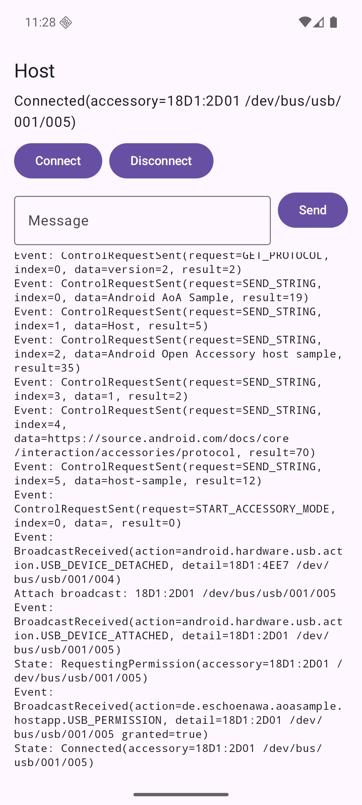
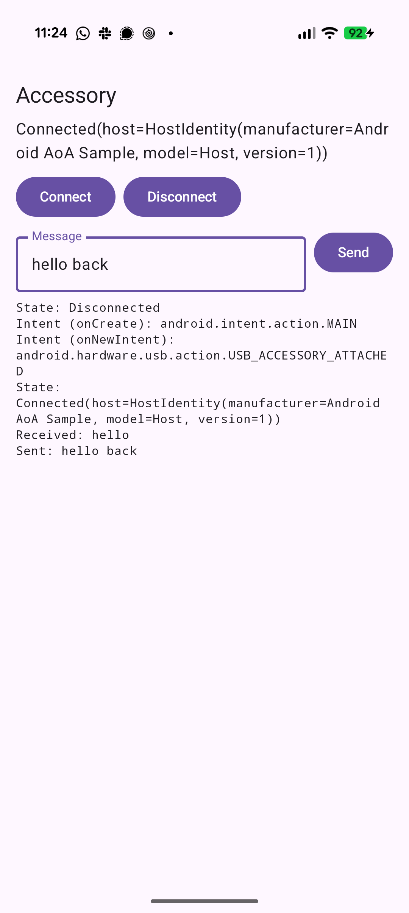

# Android Open Accessory sample

Two apps that talk to each other over USB using Android Open Accessory (AoA) without any SDK.

| Host | Accessory |
|---|---|
|  |  |

## Naming

- **Host**: the device in USB host mode. It sends AoA control requests 51, 52 and 53.
- **Accessory**: the Android device that the Host switches into Accessory mode.

AOSP naming is confusing on the Accessory side: `UsbManager.accessoryList` returns a `UsbAccessory`, but that object describes the external **Host**. On the Host side, the Accessory appears as a `UsbDevice`.

## Modules

```text
host-app      → aoa:host      → aoa:common
accessory-app → aoa:accessory → aoa:common
```

- `aoa:host` and `aoa:accessory` expose a `HostConnection` / `AccessoryConnection` contract with `state`, `events` and `messages`. `connectUntilDetachedOrCancelled()` runs one session; cancelling it disconnects.
- `aoa:common` only contains a 4-byte length-prefixed framing. AoA transfers raw bytes, so framing is needed to restore message boundaries. It is not part of AoA.
- Each app uses MVVM with Compose: Screen → ViewModel → connection contract. The log shows state changes, control requests, broadcasts and intents.

## Host flow

1. While the app is open, a `USB_DEVICE_ATTACHED` broadcast starts the connection. Find the single attached `UsbDevice` and request permission.
2. `51 GET_PROTOCOL` reads the AoA version.
3. `52 SEND_STRING` sends manufacturer, model, description, version, URI and serial.
4. `53 START_ACCESSORY_MODE` starts Accessory mode.
5. The device detaches and re-enumerates as `18D1:2D00`–`2D05`.
6. Request permission again, claim the vendor interface, then use bulk IN/OUT endpoints.

If the device is already in Accessory mode, steps 2–5 are skipped.

- A device that is already plugged in when the app opens does not trigger a broadcast. Press Connect.
- The attach listener lives as long as the `HostViewModel`. It keeps running in the background and stops when the screen is destroyed.

## Accessory flow

1. `USB_ACCESSORY_ATTACHED` starts the app, filtered by `res/xml/accessory_filter.xml`. If the app is already open, the intent arrives via `onNewIntent` (`singleTask`).
2. Find the matching `UsbAccessory` and request permission.
3. `openAccessory()` returns a file descriptor. Read and write using its streams.

Disconnecting is final. Neither app reconnects automatically.

## Hardware requirements

- Two Android devices running Android 12 (API 31) or newer.
- The Host device must support USB host mode (`android.hardware.usb.host`). The Host powers the Accessory over USB.
- The Accessory device must support Android Open Accessory (`android.hardware.usb.accessory`). Most phones and tablets do.
- A cable that connects the Host's USB port to the Accessory's USB port, e.g. USB-C to USB-C, or an OTG adapter on the Host side.

## Try it

1. Install the apps:

   ```bash
   ./gradlew :host-app:installDebug       # on the Host device
   ./gradlew :accessory-app:installDebug  # on the Accessory device
   ```

2. Open **AoA Host** on the Host device.
3. Connect the two devices. If they were already connected, press **Connect** in the Host app.
4. Allow USB access on the Host device. After the Accessory re-enumerates, allow USB access again.
5. The Accessory device opens **AoA Accessory**. Allow USB access there too.
6. Once both apps show `Connected`, type a message and press **Send** on either side.

The Host identity sent in `HostActivity` must match `EXPECTED_HOST` in `AccessoryActivity` and `res/xml/accessory_filter.xml`.

## Known limitations

- Only one attached USB device is supported on the Host.
- Neither side reconnects automatically after a disconnect or detach.
- Messages are limited to 16 KB minus the 4-byte length prefix.
- The length-prefixed framing is specific to this sample. AoA itself only transfers raw bytes.
- Audio (`SET_AUDIO_MODE`) and HID requests from AOA 2.0 are not covered.
- On some devices, a blocked read on the Accessory side only returns after the cable is detached or the Host sends data. Disconnecting from the Accessory side may therefore be delayed.

## References

- [Android Open Accessory protocol 1.0](https://source.android.com/docs/core/interaction/accessories/aoa)
- [Android Open Accessory protocol 2.0](https://source.android.com/docs/core/interaction/accessories/aoa2)
- [USB host overview](https://developer.android.com/develop/connectivity/usb/host)
- [USB accessory overview](https://developer.android.com/develop/connectivity/usb/accessory)
- [`UsbManager` API reference](https://developer.android.com/reference/android/hardware/usb/UsbManager)

## License

[Apache License 2.0](LICENSE)

The Host must be in the USB host role, for example by using an OTG adapter or a cable that makes the Host the USB-C source. Apps cannot force USB roles. Emulators are not supported.
